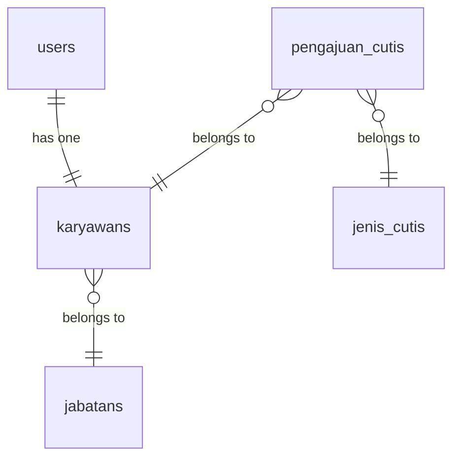

# 📋 Sistem Informasi Pengajuan Cuti

<div align="center">


</div>

Sistem Informasi Pengajuan Cuti adalah aplikasi web berbasis Laravel yang dirancang untuk mengelola pengajuan cuti karyawan secara digital. Aplikasi ini memungkinkan karyawan untuk mengajukan cuti dan admin untuk mengelola persetujuan cuti dengan mudah dan efisien.

## 📸 Screenshot

<!-- Tambahkan screenshot aplikasi Anda di sini -->


## ✨ Demo

🌐 **Live Demo**: [Demo Link](https://your-demo-url.com) (jika tersedia)

## 📋 Table of Contents

- [🚀 Fitur Utama](#-fitur-utama)
- [🛠️ Teknologi yang Digunakan](#️-teknologi-yang-digunakan)
- [📦 Persyaratan Sistem](#-persyaratan-sistem)
- [🔧 Cara Instalasi](#-cara-instalasi)
- [👥 Default Users](#-default-users)
- [📊 Database Schema](#-database-schema)
- [🔐 Role dan Permission](#-role-dan-permission)
- [🧪 Testing](#-testing)
- [🛡️ Security](#️-security)
- [📞 Support & Kontribusi](#-support--kontribusi)

## 🚀 Fitur Utama

<div align="center">
  
### 👨‍💼 Admin Features

| Feature | Deskripsi |
|---------|-----------|
| 🏠 **Dashboard Admin** | Overview sistem dengan statistik cuti |
| 👥 **Manajemen User** | Kelola akun pengguna sistem |
| 💼 **Manajemen Jabatan** | CRUD data jabatan karyawan |
| 📋 **Manajemen Jenis Cuti** | Kelola jenis-jenis cuti yang tersedia |
| 👤 **Manajemen Karyawan** | Kelola data karyawan |
| ✅ **Persetujuan Cuti** | Approve/reject pengajuan cuti karyawan |
| 📊 **Laporan Cuti** | Monitoring dan pelaporan data cuti |

### 👤 Karyawan Features

| Feature | Deskripsi |
|---------|-----------|
| 📝 **Pengajuan Cuti** | Submit permintaan cuti dengan lampiran |
| 📄 **Riwayat Cuti** | Melihat status dan history pengajuan |
| ⚙️ **Profile Management** | Kelola profil personal |

### 🔐 Sistem Keamanan

| Feature | Deskripsi |
|---------|-----------|
| 🔒 **Role-based Access Control** | Pembatasan akses berdasarkan role |
| 🔑 **Authentication Laravel Breeze** | Sistem login yang aman |
| 🛡️ **Laravel Permission** | Manajemen permission yang fleksibel |

</div>

## 🛠️ Teknologi yang Digunakan

<div align="center">

| Category | Technology |
|----------|------------|
| **Backend** |  |
| **Frontend** |   |
| **Styling** |  |
| **Database** |   |
| **Authentication** |  |
| **Permission** |  |
| **Build Tools** |  |
| **PHP Version** |  |

</div>

## 📦 Persyaratan Sistem

Pastikan sistem Anda memiliki:

-   PHP >= 8.2
-   Composer
-   Node.js >= 16.x
-   NPM atau Yarn
-   MySQL >= 8.0 atau PostgreSQL >= 13
-   Web Server (Apache/Nginx) atau PHP Built-in Server

## 🔧 Cara Instalasi

### Prasyarat
Pastikan Anda sudah menginstall:
- PHP >= 8.2
- Composer
- Node.js >= 16.x
- NPM atau Yarn
- MySQL >= 8.0 atau PostgreSQL >= 13

### Langkah-langkah Instalasi

#### 1️⃣ Clone Repository
```bash
git clone https://github.com/Brynnnn12/Sistem-Informasi-Pengajuan-Cuti.git
cd leave-management
```

#### 2️⃣ Install Dependencies PHP
```bash
composer install
```

#### 3️⃣ Install Dependencies Node.js
```bash
npm install
```

#### 4️⃣ Konfigurasi Environment
```bash
# Copy file environment
cp .env.example .env

# Generate application key
php artisan key:generate
```

#### 5️⃣ Konfigurasi Database
Edit file `.env` dan sesuaikan konfigurasi database:
```env
DB_CONNECTION=mysql
DB_HOST=127.0.0.1
DB_PORT=3306
DB_DATABASE=leave_management
DB_USERNAME=your_username
DB_PASSWORD=your_password
```

#### 6️⃣ Migrasi Database
```bash
# Jalankan migrasi
php artisan migrate

# Jalankan seeder (optional)
php artisan db:seed
```

#### 7️⃣ Storage Link
```bash
php artisan storage:link
```

#### 8️⃣ Build Assets
```bash
# Development
npm run dev

# Production
npm run build
```

#### 9️⃣ Jalankan Aplikasi
```bash
# Menggunakan PHP built-in server
php artisan serve
```

🎉 **Aplikasi akan berjalan di** `http://localhost:8000`

## 👥 Default Users

Setelah menjalankan seeder, Anda dapat login dengan:

| Role | Email | Password |
|------|-------|----------|
| 👨‍💼 **Admin** | `admin@example.com` | `password` |
| 👤 **Karyawan** | `employee@example.com` | `password` |

## 📊 Database Schema

<div align="center">

### 🗃️ Tabel Utama

| Tabel | Deskripsi |
|-------|-----------|
| `users` | Data pengguna sistem |
| `karyawans` | Data karyawan |
| `jabatans` | Data jabatan |
| `jenis_cutis` | Jenis-jenis cuti |
| `pengajuan_cutis` | Data pengajuan cuti |

### 🔗 Relasi Database



</div>

## 🔐 Role dan Permission

### Admin Role:

-   Kelola semua data master
-   Approve/reject pengajuan cuti
-   Akses laporan lengkap

### Employee Role:

-   Submit pengajuan cuti
-   View riwayat cuti sendiri
-   Update profil personal

## 📱 Responsive Design

Aplikasi ini menggunakan Tailwind CSS dan dirancang untuk:

-   Desktop browsers
-   Tablet devices
-   Mobile phones

## 🧪 Testing

Menjalankan test:

```bash
# Unit tests
php artisan test

# Feature tests dengan Pest
./vendor/bin/pest
```

## 📝 API Documentation

Jika diperlukan, API endpoints tersedia di:

-   `/api/pengajuan` - Pengajuan cuti endpoints
-   `/api/karyawan` - Karyawan data endpoints

## 🛡️ Security

-   CSRF protection enabled
-   XSS protection
-   SQL injection prevention
-   File upload validation
-   Rate limiting

## 🔄 Update Guide

Untuk update aplikasi:

```bash
git pull origin main
composer update
npm update
php artisan migrate
npm run build
php artisan config:cache
```

## 📞 Support & Kontribusi

<div align="center">

### 🤝 Kontribusi
Kontribusi sangat diterima! Ikuti langkah berikut:

1. 🍴 Fork repository
2. 🌿 Buat feature branch (`git checkout -b feature/AmazingFeature`)
3. 💾 Commit changes (`git commit -m 'Add some AmazingFeature'`)
4. 📤 Push ke branch (`git push origin feature/AmazingFeature`)
5. 🔄 Buat Pull Request

### 📞 Dukungan
Jika Anda mengalami masalah atau memiliki pertanyaan:

[](https://github.com/Brynnnn12/Sistem-Informasi-Pengajuan-Cuti/issues)
[](mailto:your-email@example.com)

</div>

## 📈 Future Features

- [ ] 📧 Email notifications
- [ ] 📱 SMS notifications  
- [ ] 📱 Mobile app
- [ ] 📊 Advanced reporting
- [ ] 📅 Calendar integration
- [ ] ⚙️ Workflow customization
- [ ] 🔄 Multi-language support
- [ ] 📈 Analytics dashboard

## 📄 License

Aplikasi ini menggunakan [MIT License](https://opensource.org/licenses/MIT).

---

**Dibuat dengan ❤️ menggunakan Laravel Framework**
